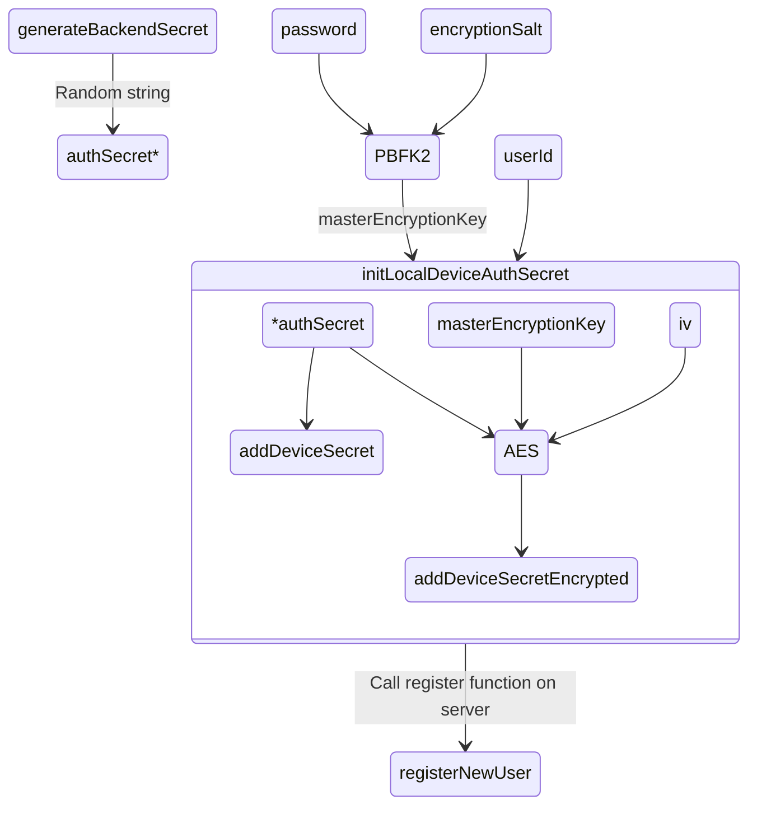

# Authentication

This is (in progress) simple description of authentication process in authier

# Client

#### Register

1. Get password from user
2. generate encryption salt
3. PBFK2 = password + encryption salt = masterEncryptionKey
4. AES = `authSecret` + `masterEncryptionKey` + `userId` = addDeviceSecretEncrypted (+ addDeviceSecret)

- authSecret = random string
- we use AES cypher to get `addDeviceSecretEncrypted` from materEncryptionKey, userId and authSecret

5. Call `registerNewUser` mutation
6. If accessToken is in the responce we create state

#### Login

1. Get password from user
2. call `deviceDecryptionChallenge` mutation, which creates decryptionChallange and wait for master device confirmation
3. Master device confirm challange
4. Use PBDFK2 for password encryption (masterEncryptionKey)
5. Try to decrypt `addDeviceSecretEncrypted` (from decryptionChallange) with masterEncryptionKey and parsed `userId`
   (If is decrypted deviceSecret same as the one from decryptionChallange, we know that the master password is correct)
6. Generate new deviceSecret and encrypt it with masterEncryptionKey
7. Call `addNewDevice` mutation on backend

# Server mutations

### registerNewUser

1. create user with device in DB
2. check if user with such email or device exists
3. get the current user device and set it on master
4. returns signed accessToken with user data

### deviceDecryptionChallenge

1. Get user by email (if exists)
2. Check if is user blocked
3. Check decryption challenge count
4. Get current device with challenge
5. If we find only one device in DB witout challenge, we create one challenge and mark it as approved
6. Check if is challenge rejected
7. If we dont find any challenge, we check for firebaseToken. If it has ont we send notification and create challenge
8. Check if is challenge approved and return `addDeviceSecretEncrypted` with `encryptionSalt`

## addNewDevice

1. Get user by userId
2. Check if user exists and if we got right addDeviceSecet (masterPassword validation)
3. Update user with new `addDeviceSecret` and `addDeviceSecretEncrypted`
4. Mark device's decryption challenge as masterPasswordVerified
5. Check if is device registered for another user
6. Create new device in DB
